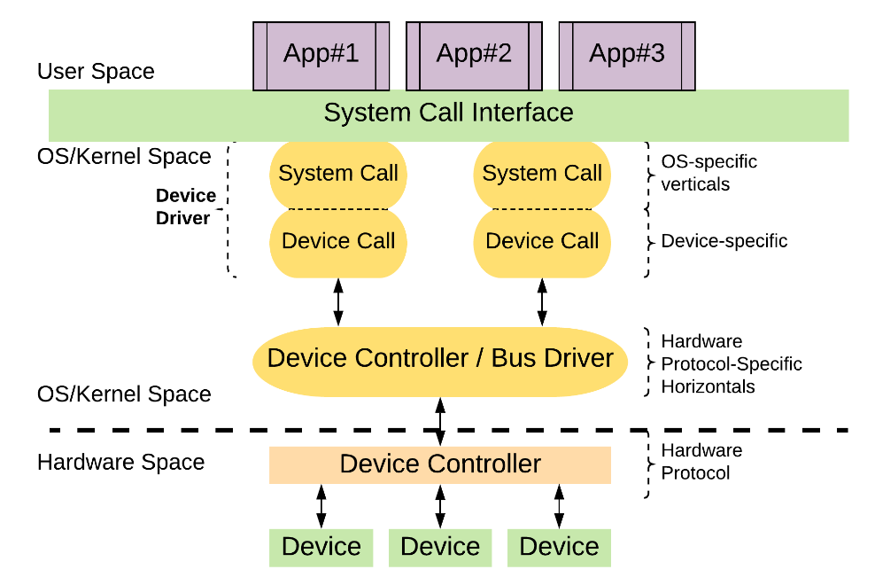

# Trabajo Practico N° 5 - Sistemas de Computacion - Character Device Drivers

## Integrantes 

* Pary Joaquin
* Colque Santiago
* Angeloff Jorge

## Objetivos

El objetivo de este Trabajo Practico es diseñar y construir un `CDD` (Character Device Driver) que permita sensar dos señales externas con un periodo de un segundo. Los datos obtenidos se procesaran con una aplicacion a nivel de usuario, que recibira una de las señales y la graficara en funcion del tiempo. La aplicacion tendra la capacidad de indicar al `CDD` cual de las dos señales debe leer. Las correcciones de escalas de las mediciones, si son necesarias, se realizaran a nivel de usuario. Los graficos de la señal deben mostrar el tipo de señal que se esta sensando, con unidades en las abcisas y tiempo en las ordenada. Ademas, al cambiar de señal, el grafico debe reiniciarse y ajustarse a la nueva medicion.

## Conceptos

### Device Driver

Un `Device Driver` (controlador de dispositivo) es un software que permite al sistema operativo comunicarse con el hardware de un dispositivo. Actúa como un traductor entre el sistema operativo y el hardware, gestionando las comunicaciones y facilitando la ejecución de las instrucciones entre ellos.

### Device Controller
Un device controller es un componente de hardware que gestiona la comunicación y control de un dispositivo periférico, actuando como intermediario entre el dispositivo y el sistema operativo. Traduce señales eléctricas del dispositivo en datos comprensibles para la CPU y viceversa, gestionando la transmisión de datos y las interrupciones generadas por el dispositivo para notificar eventos a la CPU.

### Bus Controller
Un bus controller es un componente que gestiona la comunicación entre la CPU y varios dispositivos conectados a un bus del sistema. Coordina el flujo de datos en el bus, gestiona las solicitudes de acceso al bus para evitar conflictos y facilita la comunicación entre la CPU, la memoria y los dispositivos periféricos, asegurando una transferencia de datos ordenada y eficiente.

### Conexión entre Device Controllers y Bus Controllers
Los device controllers se conectan al bus del sistema y se comunican con sus respectivos dispositivos periféricos. Los bus controllers gestionan las solicitudes de la CPU para interactuar con estos dispositivos a través del bus, coordinando el acceso y manejo de interrupciones para asegurar una operación eficiente y sin conflictos entre los diferentes componentes del sistema.



## Desarrollo

El Trabajo requiere el uso de una `Raspberry Pi`, por lo que se detallara la configuracion del entorno para trabajar con el dispositivo.

### Configuracion de SSH

Se puede configurar la `Rasberry Pi` para poder conectarse mediante `SSH` lo que permite evitar el uso de un monitor asi como que computadoras remotas puedan acceder al dispositivo al mismo tiempo.

Para habilitar la conexion ssh se debe usar el siguente comando:

```bash
sudo raspi-config
```


>Interfacing Options >>> SSH >>> Yes 

Seguido de un `sudo reboot` para asegurarse de aplicar los cambios.

Por ultimo, se podra conectar a la `Raspi`

```bash
ssh sistcomp@192.178.1.57
```


### SSH Fuera del Area Local

Tambien se puede configurar para poder acceder desde otra computadora que este fuera del `Area Local`.

Para ello, se debe entrar a la configuracion del `Router` y abrir un puerto, por ejemplo el puerto `22`.


Entonces, de manera similar obteniendo la `IP` publica y conociendo el puerto utilizado, se puede conectar desde una red externa:

```bash
ssh sistcomp@xxx.xxx.x.xx -p 22
```


### Character Device Driver

Al cargar el modulo de kernel (nuestro driver) utilizando
``` bash
sudo insmod cdd.ko
```
podemos ver que se genera un nuevo archivo en /proc/devices.


Este archivo `gpio_driver_sc`, es el `character device file`, y sera la forma de acceder al driver desde una aplicacion a nivel usuario. Se trata de un `archivo virtual`, ya que aunque aparece en el filesystem, no son como los archivos habituales. 
Cuando un usuario lee el `cdf` o `device node`, el kernel copia la informacion capturada por el driver hacia el espacio de memoria de la aplicacion. De igual forma, cuando se escribe en este archivo, la informacion es copiada por el kernel desde la aplicacion hacia los buffers del driver. La forma de acceder a este nodo desde una aplicacion de usuario es utilizando `system calls`.

Al ejecutar `dmesg` podemos ver las acciones que realiza el driver desde que es cargado en el kernel.


Los primeros mensajes informan que el modulo es cargado correctamente.
Si analizamos los mensajes que siguen, tenemos los `open()` que notifican cuando se accede al archivo `gpio_driver_sc`.
Luego, los mensajes que expresan `write()` refieren a cuando el usuario elige si desea leer la señal por el pin 1 o 2.
De manera similar, `read()` traslada la informacion recibida por el pin hacia la aplicacion de usuario.
Y finalmente, `close()` se imprime luego de leer la informacion o informar al driver del pin elegido, cuando se cierra el archivo `cdf`.

### Signal Generator

La generacion de la señal se realizo con un script en `python` (`signal_generator.py`)que genera una señal cuadrada por los puertos `GPIO` de la `Raspberry Pi`.

```python
import RPi.GPIO as GPIO
import time

# Config GPIO PINs
GPIO_PIN1 = 26  
GPIO_PIN2 = 19  

# Config GPIO library
GPIO.setmode(GPIO.BCM)
GPIO.setup(GPIO_PIN1, GPIO.OUT)
GPIO.setup(GPIO_PIN2, GPIO.OUT)

# Function to generate a square signal
def generate_signal(pin, period, duration):
    half_period = period / 2
    end_time = time.time() + duration
    while time.time() < end_time:
        GPIO.output(pin, GPIO.HIGH)
        time.sleep(half_period)
        GPIO.output(pin, GPIO.LOW)
        time.sleep(half_period)

while True:
    signal = input("Select PIN to generate signal (1 or 2) or 0 to exit:")
    if signal == '1':
        generate_signal(GPIO_PIN1, 5, 25)
        continue
    if signal == '2':
        generate_signal(GPIO_PIN2, 10, 50)
        continue
    if signal == '0':
        break

print("Cleaning up GPIO...")
GPIO.cleanup()
```


Se utilizaron los pines `26` para la `señal 1` y `19` para la `señal 2`.

### Signal Receiver

Para graficar las señales (`signal_receiver.py`) se realizo otro script en `python`, en el que se selecciona el `PIN` a leer. Esta eleccion se escribe en el `Character Device File` `gpio_driver_sc`, lo que habilita la lectura del pin, y permite graficar la señal sensada.

```python
DEVICE_FILE = "/dev/gpio_driver_sc"

# Function to select the GPIO signal
def select_signal(signal):
    with open(DEVICE_FILE, 'w') as file:
        file.write("{}".format(signal))

```

Es necesario que previamente se modifiquen los permisos, habilitando la `lectura` y `escritura` del archivo.

```bash
sudo chmod a+rw /dev/gpio_driver_sc
```
Si conectamos los pines definidos como entradas y salidas, y luego ejecutamos los scripts de generacion de señales y lectura de gpio, tenemos lo siguiente:


Como podemos ver, la señal se muestra correctamente y es notorio que ambas tienen distinta frecuencia. El usuario es capaz de elegir que pin desea sensar en la aplicacion a nivel de usuario, y luego es el driver el encargado de habilitar la lectura por el pin seleccionado. 
Las señales son generadas por la propia raspberry por pura conveniencia, pero tanto el driver como el script de recepcion pueden utilizarse con señales externas (en tanto sean digitales y con un valor en alto de 3.3V).
### Referencias

Linux Driver Development with Raspberry Pi - Practical Labs

https://www.raspberrypi.com/documentation/computers/remote-access.html

https://www.raspberrypi.com/documentation/computers/raspberry-pi.html#gpio-and-the-40-pin-header
